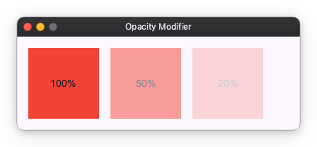
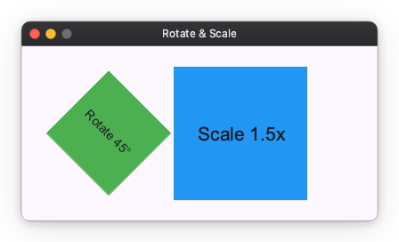
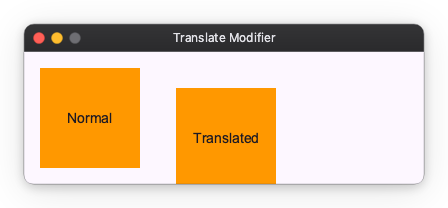

# Transform Modifiers

Transform modifiers are used to apply paint-only transformations to Widgets, such as opacity, rotation, scaling, and translation. These transformations do not affect the layout or hit-testing of the Widget.

## Opacity

You can change the opacity of a Widget using the `opacity` modifier. It takes a value between 0.0 (transparent) and 1.0 (opaque).

```python
import nuiitivet.material as nv

# 100% opacity
box1 = nv.Container(child=nv.Text("100%")).modifier(nv.background("#F44336"))

# 50% opacity
box2 = nv.Container(child=nv.Text("50%")).modifier(nv.background("#F44336") | nv.opacity(0.5))

# 20% opacity
box3 = nv.Container(child=nv.Text("20%")).modifier(nv.background("#F44336") | nv.opacity(0.2))
```



## Rotate and Scale

You can rotate a Widget using the `rotate` modifier and scale it using the `scale` modifier.

```python
import nuiitivet.material as nv

# Rotate 45 degrees
box1 = nv.Container(child=nv.Text("Rotate 45°")).modifier(
    nv.background("#4CAF50") | nv.rotate(45)
)

# Scale 1.5x
box2 = nv.Container(child=nv.Text("Scale 1.5x")).modifier(
    nv.background("#2196F3") | nv.scale(1.5)
)
```



## Translate

You can translate a Widget using the `translate` modifier. It takes an offset tuple `(dx, dy)`.

```python
import nuiitivet.material as nv

# Normal
box1 = nv.Container(child=nv.Text("Normal")).modifier(nv.background("#FF9800"))

# Translated
box2 = nv.Container(child=nv.Text("Translated")).modifier(
    nv.background("#FF9800") | nv.translate((20, 20))
)
```


