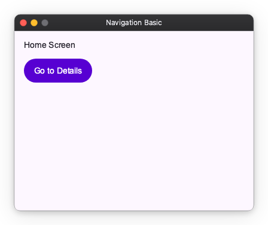

# Navigation Overview

Nuiitivet provides a robust navigation system for managing screen transitions and routing within your application. The navigation system is built around the `Navigator` widget, which manages a stack of `Route` objects.

## The Navigator

The `Navigator` is a widget that manages a set of child widgets with a stack discipline. It allows you to transition between different screens (or "pages") in your application.

When you use `MaterialApp.navigation()`, a root `Navigator` is automatically created and configured for you. You can access this root navigator from anywhere in your application using `Navigator.root()`.

## Basic Navigation: Push and Pop

The most common navigation operations are `push` and `pop`.



### Pushing a New Screen

To navigate to a new screen, you use the `push()` method. This adds a new route to the top of the navigator's stack, making it the currently visible screen.

```python
import nuiitivet as nv

from nuiitivet.navigation import Navigator
from nuiitivet.material import FilledButton, Text
from nuiitivet.layout.column import Column
from nuiitivet.widgeting.widget import ComposableWidget
from nuiitivet.widgets.box import Box

class HomeScreen(ComposableWidget):
    def build(self):
        def navigate_to_details():
            # Push a new widget directly onto the navigation stack
            Navigator.root().push(DetailsScreen())

        return Column(
            padding=16,
            gap=12,
            children=[
                Text("Home Screen"),
                FilledButton("Go to Details", on_click=navigate_to_details),
            ],
        )
```

### Popping the Current Screen

To return to the previous screen, you use the `pop()` method. This removes the top route from the navigator's stack, revealing the route beneath it. Let's look at the `DetailsScreen` that we pushed in the previous example.

```python
class DetailsScreen(ComposableWidget):
    def build(self):
        def go_back():
            # Pop the current screen off the navigation stack
            Navigator.root().pop()

        return Box(
            background_color="#F5F7FF",
            width=nv.Sizing.flex(1),
            height=nv.Sizing.flex(1),
            child=Column(
                padding=16,
                gap=12,
                children=[
                    Text("Details Screen"),
                    FilledButton("Back", on_click=go_back),
                ],
            ),
        )
```

## The Stack Structure

The `Navigator` maintains a stack of routes. When you call `push()`, the new screen is placed on top of the stack. If you call `push()` multiple times, the screens are stacked on top of each other.

For example, if you are on Screen A and push Screen B, the stack becomes `[Screen A, Screen B]`. If you then push Screen C, the stack becomes `[Screen A, Screen B, Screen C]`.

Calling `pop()` removes the top screen. In the previous example, calling `pop()` from Screen C will remove it, leaving `[Screen A, Screen B]`, and Screen B will become visible again.

This stack-based approach makes it easy to manage complex navigation flows and ensures that users can always navigate back to where they came from.

## Next Steps

- Learn how to customize transitions using [PageRoute](navigation_route.md).
- Discover how to decouple navigation logic using [Intents](navigation_intent.md).
- Explore advanced navigation patterns with [MaterialNavigator](navigation_sub.md).
