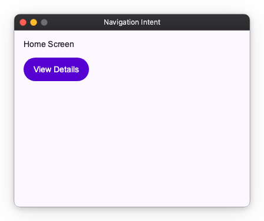

# Intent-Based Navigation

In larger applications, hardcoding widget creation inside your navigation logic can lead to tight coupling between different parts of your app. Nuiitivet provides an Intent-based navigation system to solve this problem.

## What is an Intent?

An Intent is simply a data class that represents a request to navigate to a specific screen. It can carry any data needed by that screen.

```python
from dataclasses import dataclass

@dataclass
class DetailsIntent:
    item_id: int
```

## Configuring Navigator.intents()

To use Intents, you create a Navigator with the `Navigator.intents(...)` factory and pass it to `App(...)`. You provide a mapping of Intent types to route builder functions.



```python
import nuiitivet.material as nv

from dataclasses import dataclass


@dataclass
class HomeIntent:
    pass


@dataclass
class DetailsIntent:
    item_id: int

class HomeScreen(nv.ComposableWidget):
    def build(self):
        return nv.Column(
            padding=16,
            gap=12,
            children=[
                nv.Text("Home Screen"),
                nv.Button("View Details", on_click=lambda: nv.Navigator.root().push(DetailsIntent(item_id=42)), style=nv.ButtonStyle.filled()),
            ],
        )

class DetailsScreen(nv.ComposableWidget):
    def __init__(self, intent: DetailsIntent):
        super().__init__()
        self.intent = intent

    def build(self):
        return nv.Container(
            width=nv.Sizing.flex(1),
            height=nv.Sizing.flex(1),
            child=nv.Column(
                padding=16,
                gap=12,
                children=[
                    nv.Text(f"Details for item {self.intent.item_id}"),
                    nv.Button("Back", on_click=lambda: nv.Navigator.root().pop(), style=nv.ButtonStyle.filled()),
                ],
            ),
        ).modifier(nv.background("#F5F7FF"))

app = nv.App(
    nv.Navigator.intents(
        initial_route=HomeIntent(),
        routes={
            HomeIntent: lambda _: HomeScreen(),
            DetailsIntent: lambda intent: DetailsScreen(intent),
        },
    ),
    title="Navigation Intent",
    width=400,
    height=300,
)
```

## Navigating with Intents

Once configured, you can navigate by pushing an Intent object to the `Navigator`. The `Navigator` will automatically resolve the Intent to the correct route using the mapping you provided.

```python
import nuiitivet.material as nv

def go_to_details():
    # Push an Intent instead of a Widget or Route
    nv.Navigator.root().push(DetailsIntent(item_id=42))

nv.Button(
    "View Details",
    on_click=go_to_details,
 style=nv.ButtonStyle.filled())
```

## Why Use Intents?

Intent-based navigation is highly recommended, especially when navigating from a ViewModel or controller. It allows your business logic to request a screen transition without needing to know how that screen is built or what widgets it uses. This separation of concerns makes your code more modular, testable, and easier to maintain.

Here is an example of how a ViewModel can trigger navigation using `Navigator` and Intents. You can pass `Navigator.root()` to your ViewModel:

```python
import nuiitivet.material as nv

class ItemViewModel:
    def __init__(self, item_id: int, navigator: nv.Navigator):
        self.item_id = item_id
        # The ViewModel only needs Navigator for dispatching intents.
        self.navigator = navigator

    def on_item_selected(self):
        self.navigator.push(DetailsIntent(item_id=self.item_id))

# In your View or composition root:
# view_model = ItemViewModel(item_id=42, navigator=Navigator.root())
```

Because the ViewModel only depends on `Navigator` and `DetailsIntent`, you can test the navigation decision logic in isolation.
