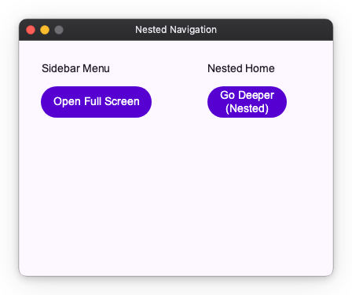

# Nested Navigation with Navigator

The App's navigator is what you want for full-screen transitions, but you might sometimes need to navigate within a specific part of your screen, such as inside a tab or a split pane. This is known as nested navigation.

## Using Navigator

You can create a nested navigation area by placing a `Navigator` widget anywhere in your widget tree. You can initialize it with a single initial screen.



```python
import nuiitivet.material as nv


class NestedHome(nv.ComposableWidget):
    def build(self):
        return nv.Column(
            padding=16,
            gap=12,
            children=[
                nv.Text("Nested Home"),
                nv.Button("Go Deeper (Nested)", on_click=lambda: nv.Navigator.of(self).push(NestedDetails()), style=nv.ButtonStyle.filled()),
            ],
        )

class NestedDetails(nv.ComposableWidget):
    def build(self):
        return nv.Container(
            width="wt",
            height="wt",
            child=nv.Column(
                padding=16,
                gap=12,
                children=[
                    nv.Text("Nested Details"),
                    nv.Button("Back (Nested)", on_click=lambda: nv.Navigator.of(self).pop(), style=nv.ButtonStyle.filled()),
                ],
            ),
        ).modifier(nv.background("#F5F7FF"))

class FullScreenDetails(nv.ComposableWidget):
    def build(self):
        return nv.Container(
            width="wt",
            height="wt",
            child=nv.Column(
                padding=20,
                gap=12,
                children=[
                    nv.Text("Full Screen Details"),
                    nv.Button("Back (Full Screen)", on_click=lambda: nv.Navigator.of(self, root=True).pop(), style=nv.ButtonStyle.filled()),
                ],
            ),
        ).modifier(nv.background("#EEF7F0"))

class MainScreen(nv.ComposableWidget):
    def build(self):
        return nv.Row(
            width="wt",
            height="wt",
            gap=12,
            padding=12,
            children=[
                # Left side: Static menu
                nv.Container(
                    width=200,
                    height="wt",
                    child=nv.Column(
                        padding=12,
                        gap=10,
                        children=[
                            nv.Text("Sidebar Menu"),
                            nv.Button("Open Full Screen", on_click=lambda: nv.Navigator.of(self, root=True).push(FullScreenDetails()), style=nv.ButtonStyle.filled()),
                        ],
                    ),
                ),
                # Right side: Nested Navigator
                nv.Container(
                    width="wt",
                    height="wt",
                    child=nv.Navigator(
                        routes=[nv.Route(builder=lambda: NestedHome())]
                    ),
                ),
            ],
        )
```

## Navigating within a Nested Navigator

`Navigator.of(context)` searches up the widget tree for the nearest `Navigator`, so the same call means "this region's navigator" wherever you write it. Add `root=True` to skip any nested navigator and target the App's.

In the example above:

- The "Go Deeper (Nested)" button uses `Navigator.of(self).push()` to change only the right side of the screen, leaving the sidebar intact.
- The "Open Full Screen" button uses `Navigator.of(self, root=True).push()` to replace the entire `MainScreen`.

`MainScreen` has no `Navigator` ancestor of its own, so plain `Navigator.of(self)` would resolve to the App's navigator there anyway — the nested one is a *descendant*, not an ancestor. Writing `root=True` states the intent rather than relying on the tree shape, which keeps the call correct if the screen is later moved inside a nested navigator.

By using `Navigator` and `Navigator.of()`, you can create complex, multi-layered navigation structures within your application, allowing for independent navigation flows in different sections of the UI.
