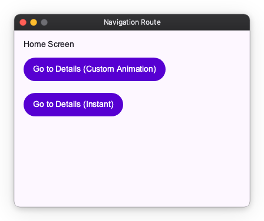

# Route and Animations

While you can push widgets directly to the `Navigator`, using `Route` gives you more control over the transition animations and lifecycle of the screen.

## Customizing Animations

By default, `App` applies a standard Material Design transition when navigating between screens. However, you can customize this behavior by providing a `TransitionSpec` to a `Route`.

Nuiitivet provides built-in transition effects such as `FadeIn`, `FadeOut`, `ScaleIn`, `ScaleOut`, `SlideInVertically`, and `SlideOutVertically`. You can combine these effects using the `|` operator to create complex animations.



```python
import nuiitivet.material as nv


class AnimatedScreen(nv.ComposableWidget):
    def build(self):
        return nv.Container(
            width="wt",
            height="wt",
            child=nv.Column(
                padding=16,
                gap=12,
                children=[
                    nv.Text("Animated Screen"),
                    nv.Button("Back", on_click=lambda: nv.Navigator.of(self).pop(), style=nv.ButtonStyle.filled()),
                ],
            ),
        ).modifier(nv.background("#F5F7FF"))

def navigate_with_custom_animation():
    # Create a custom transition: Slide up and fade in on enter, slide down and fade out on exit
    custom_transition = nv.MaterialTransitions.page(
        enter=nv.FadeIn() | nv.SlideInVertically(initial_offset_y=50.0),
        exit=nv.FadeOut() | nv.SlideOutVertically(target_offset_y=50.0)
    )

    route = nv.Route(
        builder=lambda: AnimatedScreen(),
        transition_spec=custom_transition
    )
    nv.Navigator.of(self).push(route)
```

## Disabling Animations

If you want to transition to a new screen instantly without any animation, you can use `Transitions.empty()`.

```python
import nuiitivet.material as nv


class InstantScreen(nv.ComposableWidget):
    def build(self):
        return nv.Container(
            width="wt",
            height="wt",
            child=nv.Column(
                padding=16,
                gap=12,
                children=[
                    nv.Text("Instant Screen"),
                    nv.Button("Back", on_click=lambda: nv.Navigator.of(self).pop(), style=nv.ButtonStyle.filled()),
                ],
            ),
        ).modifier(nv.background("#F5F7FF"))

def navigate_instantly():
    route = nv.Route(
        builder=lambda: InstantScreen(),
        transition_spec=nv.Transitions.empty()
    )
    nv.Navigator.of(self).push(route)
```

Using `Route` and `TransitionSpec` allows you to create smooth, visually appealing transitions or optimize for speed by disabling them entirely.
