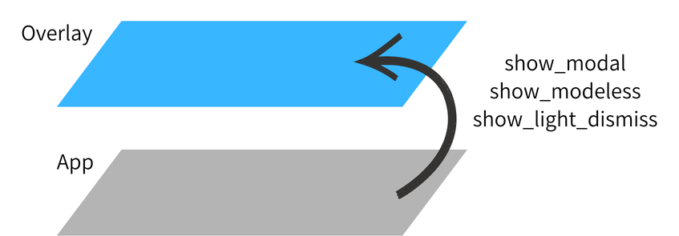

# Overlay

`Overlay` is the framework's system for displaying content above the main widget tree. It acts as a transparent full-screen layer that sits on top of all other widgets, allowing you to show dialogs, toasts, menus, and other transient UI elements without disturbing the underlying layout.



## Role in the Widget Tree

`App` creates and mounts an `Overlay` at the root of the widget tree. Content pushed into the overlay is rendered above all other widgets, regardless of their position in the tree.

```text
App
└── Overlay                  ← always on top
    ├── (overlay entries)    ← managed by show_modal / show_modeless / show_light_dismiss
    └── child                ← your main widget tree
```

## Accessing Overlay

Use `Overlay.root()` to retrieve the globally registered overlay instance. This works from anywhere in the application.

```python
from nuiitivet.overlay import Overlay

overlay = Overlay.root()
```

`Overlay.of(self)` walks up the widget tree and returns the nearest ancestor `Overlay`. Use this only when you have intentionally nested an `Overlay` inside the widget tree.

```python
# Only needed when an Overlay is nested in the widget tree
overlay = Overlay.of(self)
```

## Primitives

`Overlay` exposes three primitives for displaying content above the widget tree:

| Primitive | Interaction | Outside tap |
| --------- | ----------- | ----------- |
| `show_modal` | Blocks background input | Configurable |
| `show_modeless` | Passes through to background | None |
| `show_light_dismiss` | Invisible hit layer | Closes overlay |

See [Primitives](primitives.md) for full documentation and usage examples of each primitive.

## Material Design

`MaterialOverlay` is a subclass that adds Material Design 3-specific shortcuts — `dialog()`, `snackbar()`, `bottom_sheet()`, `side_sheet()`, and `loading()`. For Material Design-specific usage, see [Material Overlay](../design-system/material_overlay.md).
