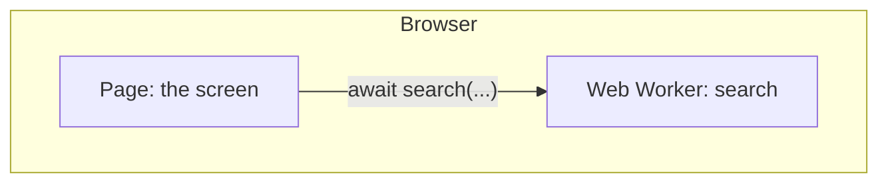
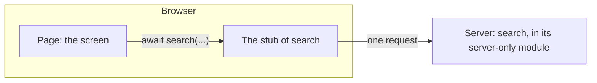

# Worker and Server Functions

An app runs in a browser from the source it runs on the desktop, and the
browser has one thread. `threading.Thread(...).start()`,
`asyncio.to_thread(...)` and `switch_map` with a plain function raise
`RuntimeError: can't start new thread`, and the handler dies there.

A worker function is the API for that work. On the desktop it runs on a
thread the runtime owns; in the browser it runs on a Web Worker, a second
Python the page starts beside the app's. The same function marked
`@nv.server` runs on a server in the browser instead: on the desktop it runs
on a thread all the same, and under `python -m nuiitivet.web run` the
command's own process answers it. The screen's code is the same on both
targets and under both marks, and so is the function's.

## Worker Function



### Mark the function and await it

```python
# jobs.py
import nuiitivet.material as nv

WORDS = [f"word{n}" for n in range(50_000)]


@nv.worker
def search(query: str) -> list[str]:
    return [word for word in WORDS if query in word]
```

```python
# app.py
from jobs import search


class SearchScreen(nv.ComposableWidget):
    query = nv.Observable("word1")
    status = nv.Observable("")

    async def search(self) -> None:
        self.status.value = f"{len(await search(self.query.value))} matches"
```

The function is a plain `def` at the top level of a module in the app's
directory, with every parameter and the return annotated. The screen awaits
it like any coroutine: the line after the `await` runs on the UI thread, with
the result, and the screen answers clicks while it waits.

In the browser the page runs one worker, which starts while the page loads;
a call made before it is up waits for it, about two seconds. Calls run one
at a time, in the order they were made: a call made while another runs
waits for it. On the desktop each call gets a thread of its own.

### Pass arguments and get the result

Arguments and the result are copied, and the type annotation decides how.
The function never sees the caller's objects, on the desktop either: a list
appended to inside the function stays as it was in the caller.

| Annotation | Carries |
| --- | --- |
| `None`, `bool`, `int`, `float`, `str`, `bytes` | The value; an `int` passed for a `float` arrives as a `float` |
| `datetime`, `date` | The value |
| An `Enum` subclass | The member |
| A dataclass of these | A dataclass of the same class |
| `list[T]`, `tuple[T, ...]`, `tuple[A, B]`, `dict[str, T]`, `Optional[T]` | The container, of these |

A value of another type, including a `bool` where an `int` is declared, is
refused with the argument named. An annotation outside the table, `Any`,
`object`, `set`, a plain `list`, is refused when the module imports.

### Report progress

A parameter annotated `nv.WriteOnlyObservable[T]` is written by the function
and read by the screen:

```python
@nv.worker
def search(query: str, progress: nv.WriteOnlyObservable[float]) -> list[str]:
    matches: list[str] = []
    for index, word in enumerate(WORDS):
        if query in word:
            matches.append(word)
        if index % 500 == 0:
            progress.value = index / len(WORDS)
    return matches
```

The caller passes an `nv.Observable[T]` and binds it as usual:

```python
class SearchScreen(nv.ComposableWidget):
    progress = nv.Observable(0.0)

    def build(self) -> nv.Widget:
        return nv.LinearProgressIndicator(value=self.progress)

    async def search(self) -> None:
        matches = await search(self.query.value, self.progress)
```

Each write lands on the caller's observable on the UI thread. A tight loop
can write as often as it likes: the screen sees the latest value per frame.
The function cannot read the observable back, and a type checker says so.

### Cancel

A parameter annotated `nv.CancelToken`, with `nv.CancelToken()` as its
default, is set when the caller gives up. The function checks
`cancel.cancelled` and returns:

```python
@nv.worker
def search(
    query: str,
    progress: nv.WriteOnlyObservable[float],
    cancel: nv.CancelToken = nv.CancelToken(),
) -> list[str]:
    for index, word in enumerate(WORDS):
        if cancel.cancelled:
            break
        ...
```

The caller gives up by cancelling the task that awaits the call:

```python
    async def search(self) -> None:
        self._task = asyncio.ensure_future(search(self.query.value, self.progress))
        try:
            matches = await self._task
        except asyncio.CancelledError:
            self.status.value = "cancelled"

    def cancel(self) -> None:
        if self._task is not None:
            self._task.cancel()
```

The caller never passes the token; the default is the one that gets set. A
function with no `CancelToken` parameter runs to the end whatever the caller
does.

In the browser a running worker function is not told to stop: the page ends
the worker it runs on and starts another. The next call waits for that
start, about two seconds.

### Handle an error

A built-in exception raised in the function, a `ValueError`, a `KeyError`,
reaches the caller as itself. Any other class reaches it as
`nv.RemoteError`, whose text is the class name and the message:

```python
        except ValueError as error:
            self.status.value = str(error)
        except nv.RemoteError as error:
            self.status.value = str(error)  # "Rejected: not for you"
```

A `ConnectionError` says the function never answered: the worker stopped,
or the server could not be reached.

## Server Function



A server function is written as a worker function is: the same `def`, the
same arguments, progress, cancellation and errors. What changes is the
mark, and where the function's module lives.

### Mark the function

The function runs on the server, so its module, and everything that module
imports, is code of the server: the libraries installed there, the
connection it opens, the constants it reads. None of it would run in the
browser, and none of it should get there. A `@nv.server` function
therefore lives in a package whose `__init__.py` calls `nv.server_only()`,
which marks the whole package as the server's: `build` leaves it out of
the site, and in its place the page gets a stub of each module, the same
functions with the same signatures, each sending its call to the server.
`from backend.search import search` resolves on both sides, and nothing
else in the package reaches the browser.

```python
# backend/__init__.py
import nuiitivet.material as nv

nv.server_only()  # keep this package off the browser
```

```python
# backend/search.py
import nuiitivet.material as nv

WORDS = [f"word{n}" for n in range(50_000)]


@nv.server
def search(query: str, progress: nv.WriteOnlyObservable[float]) -> list[str]:
    matches: list[str] = []
    for index, word in enumerate(WORDS):
        if query in word:
            matches.append(word)
        if index % 500 == 0:
            progress.value = index / len(WORDS)
    return matches
```

```text
myapp/
├── app.py          # the screens; python -m nuiitivet.web run app.py
├── jobs.py         # the @nv.worker functions
└── backend/
    ├── __init__.py # nv.server_only(): the whole package stays on the server
    └── search.py   # the @nv.server functions
```

## 3. Choose between the two

A function moves between the marks without a change to its body or its
callers. What differs is where the call runs in the browser, and what that
costs:

| | `@nv.worker` | `@nv.server` |
| --- | --- | --- |
| Start-up | A second Python boots with the page, in parallel; a call made before it is up waits, about two seconds | The server process is already running |
| A call | About a millisecond, no network | One round trip to the server |
| Cancel | The worker is ended and another starts; the next call waits for it, about two seconds | The function stops where it checks the token |
| Computing resources | The user's machine, within what a browser tab may hold | The server's |
| Libraries | What Pyodide runs: pure Python, and the packages Pyodide ships. Each one is downloaded with the page | Anything installed on the server. Nothing is added to the page |
| Deployment | The site alone, on any file server | A Python process beside the site |
| Security | The function's code and data are in the browser, where anyone can read them | The function's module stays on the server |

Mark the work `@nv.worker` unless a row above says otherwise.

## Full samples

`samples/web/worker_functions/` and `samples/web/server_functions/` are the
same app: a search for the words within one edit of the query, with
progress, a Cancel button, and a button to click while it runs. The first
keeps `search` in `jobs.py` as a worker function; the second moves it into
the `backend` package as a server function. Search for `word1`, cancel a
search, clear the field to see the `ValueError`, and look for `secret` to
see the `RemoteError`.

## Next Steps

- [Building and Deploying](building_and_deploying.md)
- [Web overview](index.md)
