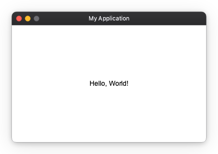
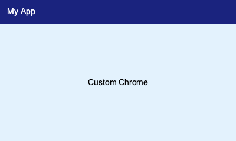
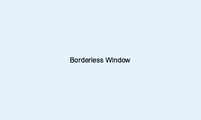

# Window Chrome

Window chrome refers to the decoration around your application window — the title bar, border, and window controls provided by the OS or drawn by the app itself. Nuiitivet lets you choose from three modes via the `chrome=` parameter on `App`:

| Value | Description |
|---|---|
| `OSChrome(variant=...)` | OS-managed chrome (default) |
| `CustomChrome(header=...)` | App-drawn header, borderless OS window |
| `None` | No chrome — bare borderless window |

## OS-managed chrome (`OSChrome`)

When `chrome=` is omitted, `OSChrome()` is used automatically. The OS draws the standard title bar, including window controls (close / minimise / maximise).

Use the `title=` parameter to set the text shown in the OS title bar. It accepts a plain string, an `Observable[str | None]` for reactive updates, or `None` for no title.

```python
import nuiitivet.material as nv

app = nv.App(
    content=nv.Container(
        alignment="center",
        width="100%",
        height="100%",
        child=nv.Text("Hello, World!"),
    ),
    title="My Application",
    width=400,
    height=240,
)
app.run()
```



### Variants

Pass `variant=` to `OSChrome` to request a different OS window style:

| Variant | Description |
|---|---|
| `"default"` | Standard window (minimize / maximize / close) |
| `"dialog"` | No minimize or maximize button |
| `"tool"` | Small title bar |
| `"borderless"` | No OS decoration (title bar drawn by OS is hidden) |
| `"transparent"` | Transparent background |

See [`OSChrome`](../../api/nuiitivet.md#nuiitivet.OSChrome) for the full API reference.

## Custom chrome (`CustomChrome`)

`CustomChrome` removes the OS title bar and lets you render any widget as the window header. Nuiitivet automatically wraps the `header` widget in `WindowDragArea` so the user can drag the window by clicking and dragging the header.

The `title=` parameter still controls the OS taskbar / Alt-Tab label even with `CustomChrome`. It accepts a plain string or an `Observable[str | None]` for reactive updates. The visual title text inside the window is entirely up to your `header` widget.

```python
import nuiitivet.material as nv

header = nv.Row(
    children=[
        nv.Text("My App", style=nv.TextStyle(color="#ffffff", font_size=14)),
    ],
    cross_alignment="center",
    width="100%",
    height=40,
    padding=(12, 0),
).modifier(nv.background("#1a237e"))

app = nv.App(
    content=nv.Container(
        alignment="center",
        width="100%",
        height="100%",
        child=nv.Text("Custom Chrome"),
    ),
    title="My App",
    chrome=nv.CustomChrome(
        header=header,
        corner_radius=8,
    ),
    width=400,
    height=240,
)
app.run()
```



See [`CustomChrome`](../../api/nuiitivet.md#nuiitivet.CustomChrome) for the full API reference.

## No chrome (`chrome=None`)

Pass `chrome=None` for a completely bare borderless window with no OS decoration and no app-drawn header.

```python
import nuiitivet.material as nv

app = nv.App(
    content=nv.Container(
        alignment="center",
        width="100%",
        height="100%",
        child=nv.Text("Borderless Window"),
    ),
    title="Borderless",
    chrome=None,
    width=400,
    height=240,
)
app.run()
```


